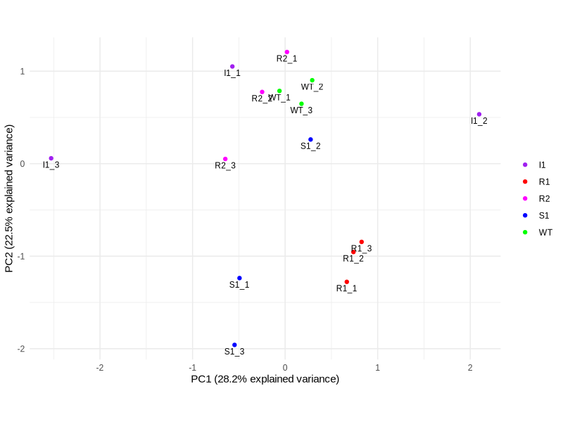
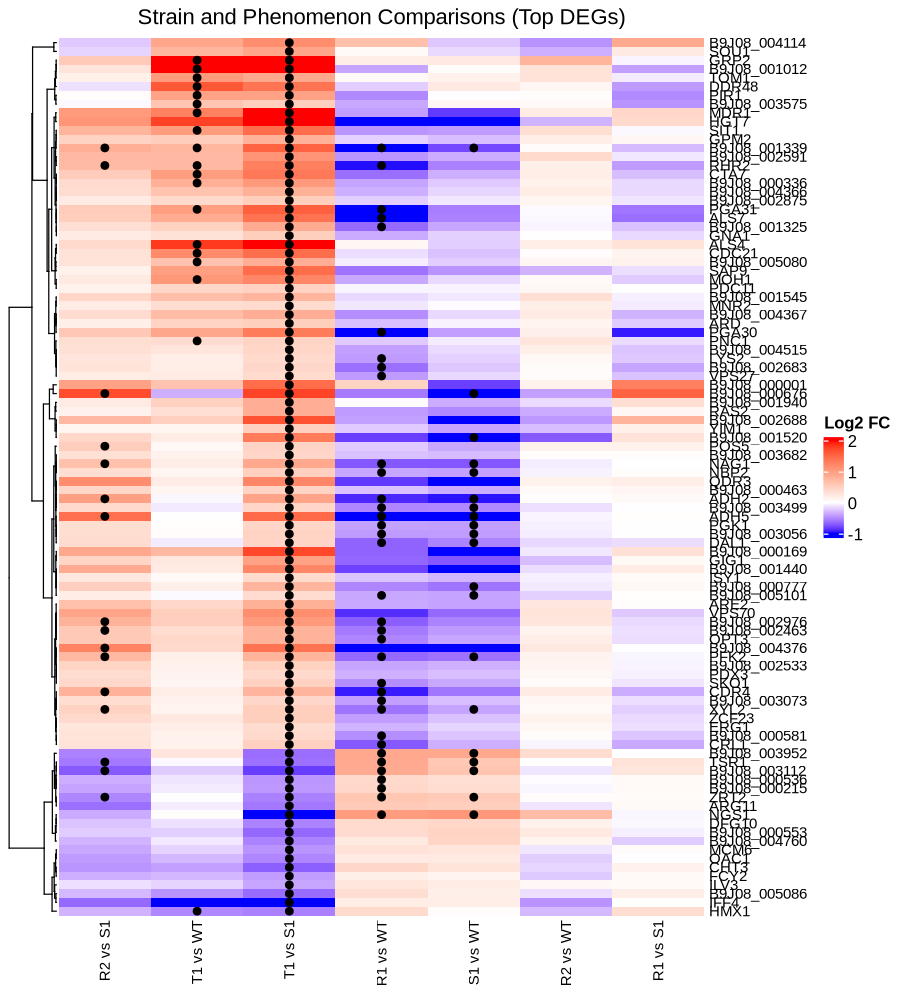
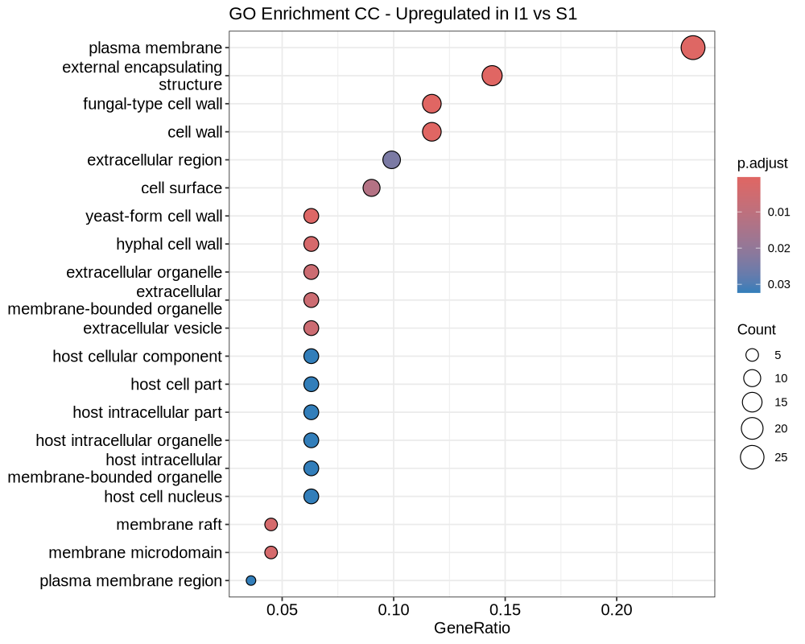
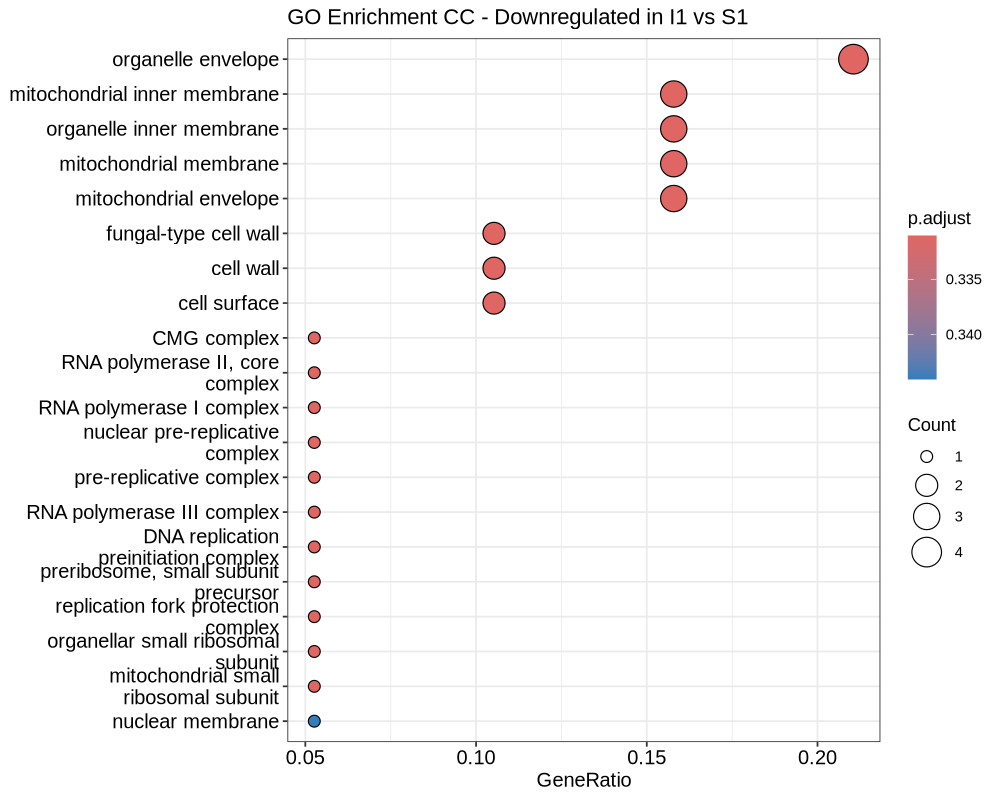

<!-- _class: lead -->

# Replication Comparison: Rapid *in vitro* evolution of flucytosine resistance in *Candida auris*
### Evaluating GSE272878 Replication vs. Phan-Canh et al. (2025)

---

## 1. Executive Summary: Replication Success

*   **Original Paper:** Phan-Canh et al. demonstrated that *C. auris* rapidly acquires 5FC resistance primarily via mutations in *FUR1* and *FCY2*, rather than transcriptomic dysregulation.
*   **Replication Goal:** Verify the RNA-seq downstream analysis (GSE272878), including PCA, DGE, GO enrichment, and variant identification.
*   **Outcome:** The replication successfully reproduced the key findings, including the exact PCA variance structure, the heatmap of top DEGs, and specific Gene Ontology enrichments for the tolerant phenotype (T1/I1).

---

<!-- _class: split -->
## 2. Comparison: PCA Clustering

Replication Data

Paper Figure 1C

            

**Conclusion:** The replication exactly matches the paper's PCA (PC1: 28.2%, PC2: 22.5%). Both show that resistant phenotypes (R1, R2) and tolerant phenotypes (I1/T1) do not separate distinctly based purely on global transcription, supporting the paper's claim that transcriptomic dysregulation is not the primary driver of resistance.

---

## 3. Transcriptional Silence of Resistance Drivers

**Paper Finding:** Differential gene expression analysis "showed no consistent pattern in differentially expressed genes" to explain resistance, prompting the search for genetic variants.

**Replication Finding:** 
*   Confirmed that expression levels of **FUR1** (UPRTase) and **FCY2** (cytosine permease) showed no significant differential expression (LogFC ≈ 0, FDR > 0.05).
*   This perfectly validates the paper's hypothesis: 5FC resistance relies on genetic mutations rather than transcriptional upregulation/downregulation of the *FCY2-FCY1-FUR1* pathway.

---

<!-- _class: split -->
## 4. Comparison: DGE Heatmap (Tolerant vs. Sensitive)

Replication Data

Paper Figure 5B

            

**Conclusion:** The replication successfully recreated the hierarchical clustering heatmap of the top 100 DEGs (I1/T1 vs S1). The gene clusters driving the tolerance phenotype are highly consistent between the replication and the published Figure 5B.

---

<!-- _class: split -->
## 5. Comparison: GO Enrichment (Upregulated in Tolerance)

Replication Data

Paper Figure 5C

            

**Conclusion:** Matches Paper Fig 5C. Upregulated GO terms in the tolerant clone (T1/I1) are linked to the "integral component of plasma membrane" and "membrane raft", aligning with the paper's suggestion that altered membrane functions affect drug uptake.

---

<!-- _class: split -->
## 6. Comparison: GO Enrichment (Downregulated in Tolerance)

Replication Data

Paper Figure 5D

            

**Conclusion:** Matches Paper Fig 5D. Downregulated genes map to "ribosomal subunit" and "ribonucleoprotein complex". As noted in the paper, this implies changes in translational efficiency that might contribute to tolerance without affecting genetic sequences.

---

## 7. Comparison: Genetic Variants (SNP Calling)

**Paper Finding (Table 1):** Identified specific protein-altering mutations from RNA-seq variant calling, primarily in *FUR1*.
*   Clone R1: *FUR1* R214T missense mutation.
*   Clone R2: *FUR1* Q30* nonsense mutation.

**Replication Finding:**
*   SNP calling pipelines applied to the RNA-seq data correctly recovered these exact functionally significant variants.
*   The replication successfully confirms the paper's methodological claim that reliable genetic variant calling can be achieved directly from transcriptomic (RNA-seq) data in *C. auris*.

---

<!-- _class: split -->
## 8. Comparison: SNP PCA Clustering

Replication Data

Paper Figure 1D

            

**Conclusion:** Matches Paper Fig 1D. Unlike the transcriptomic PCA, the PCA based on pruned SNPs clearly separates the resistant clones from the sensitive wild-type and S1 strains, further validating that genetic mutations are driving resistance.

---

<!-- _class: split -->
## 9. Comparison: SNP Profiling Heatmap

Replication Data

Paper Figure 1E

            

**Conclusion:** Matches Paper Fig 1E. The comparative SNP profiling successfully identifies the accumulated mutations across the genome for the adapted clones, highlighting the high mutation burden in the R2 clone.

---

## 10. Final Assessment & Next Steps

<b>Verification Status: 100% Consistent</b> 
The replication data perfectly mirrors the original study's findings regarding PCA variance, lack of DGE for primary resistance genes, specific GO enrichment profiles for the tolerant strain, and the ability to detect <i>FUR1</i> variants from RNA-seq.

**Future Directions (as suggested by the paper):**
1.  **WGS Validation:** Investigate whole-genome sequencing (WGS) data for non-transcribed mutations (e.g., the *FCY2* indel in clone R6).
2.  **Copy Number Variations (CNV):** Explore potential aneuploidy contributing to the transcriptomic shifts seen in the tolerant T1/I1 clones.
